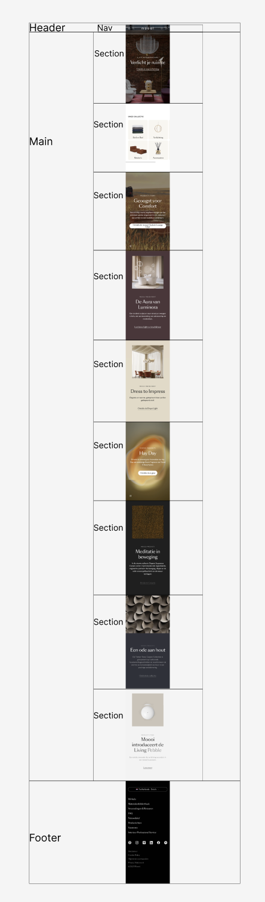
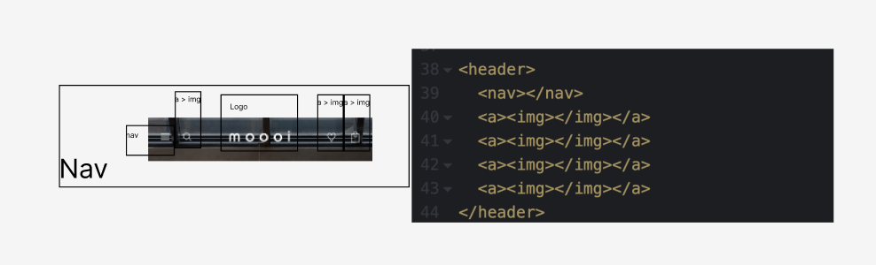
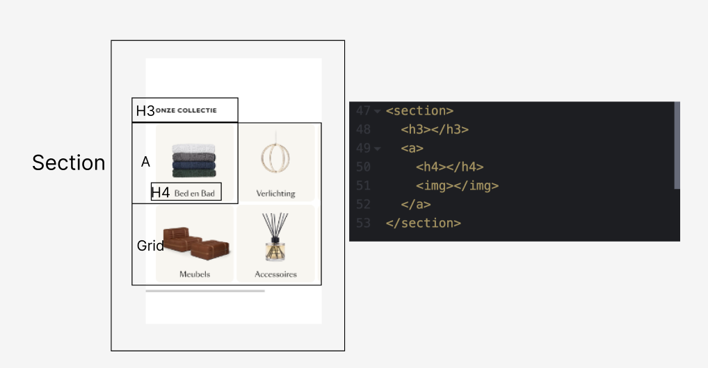
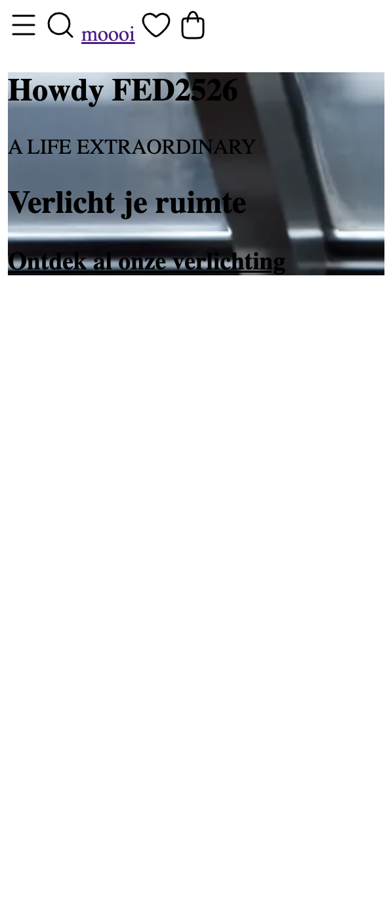

# Procesverslag
Markdown is een simpele manier om HTML te schrijven.  
Markdown cheat cheet: [Hulp bij het schrijven van Markdown](https://github.com/adam-p/markdown-here/wiki/Markdown-Cheatsheet).

Nb. De standaardstructuur en de spartaanse opmaak van de README.md zijn helemaal prima. Het gaat om de inhoud van je procesverslag. Besteedt de tijd voor pracht en praal aan je website.

Nb. Door *open* toe te voegen aan een *details* element kun je deze standaard open zetten. Fijn om dat steeds voor de relevante stuk(ken) te doen.

## Jij

  
uitwerken voor kick-off werkgroep

  ### Auteur:
  Toria Kruithof

  #### Je startniveau:
  Blauw/beetje rood

  #### Je focus:
  Responsive
 

## Je website

  
uitwerken voor kick-off werkgroep

  ### Je opdracht:
  https://www.moooi.com/nl-nl

  #### Screenshot(s) van de eerste pagina (small screen): 
  hier de naam van de pagina  
  

  #### Screenshot(s) van de tweede pagina (small screen):
  hier de naam van de pagina  
  
 

## Toegankelijkheidstest 1/2 (week 1)

  
uitwerken na test in 2e werkgroep

  ### Bevindingen
  Lijst met je bevindingen die in de test naar voren kwamen:
  Met de tab functie kreeg je een stippellijn te zien om de elementen, dat vond ik niet echt bijpassend bij de rest van de website en het viel niet echt op op sommige plekken. Maar het werkte wel. Op de telefoom moet je bij een stukje wel horizontaal scrollen, dus dat is niet helemaal de bedoeling. Ook is de website niet kantelbaar op zijn kop, wel zijwaarts. Ook kwam ik tegen dat er meerdere h1's op een pagina stonden. Vervolgens kwam ik erachter dat er niet overal alt tekst was en de tekst die er was, was niet heel erg duidelijk. Ook waren er veel linkjes met lees meer.  Alle media kan gepauzeerd worden. Voor linkjes worden op sommige momenten buttons gebruikt en andersom. Qua uiterlijk was er geen verschil tussen de donkere en lichte modus. Hetzelfde geld voor high-contrast. 

## Breakdownschets (week 1)

  
uitwerken na afloop 3e werkgroep

  ### de hele pagina: 
  

  ### dynamisch deel (bijv menu): 
  

  ### wellicht nog een dynamisch deel (bijv filter): 
  

## Voortgang 1 (week 2)

  
uitwerken voor 1e voortgang

  ### Stand van zaken
  Ik vond het fijn hoe we tijdens de lessen uitleg kregen en er veel mee konden oefenen. Hieronder wat ik tot nu toe heb op mijn website.
  
  
  ### Agenda voor meeting
  samen met je groepje opstellen

  | student 1      | student 2          | student 3    | student 4        |
  | Toria          | ---                | ---          | ---              |
  | Website laten zien | en dit             | en ik dit    | en dan ik dat    |
  | Vraag over css | dit als er tijd is | nog een punt | dit wil ik zeker |
  | ...            | ...                | ...          | ...              |

  ### Verslag van meeting
  hier na afloop snel de uitkomsten van de meeting vastleggen

  - Language aanpassen als je Engelse tekst hebt.
  - In css uppercase ipv in hoofdletters het schrijven.
  - Searchveld gebruiken ipv een gewone button.
  - Stylesheet namen veranderen
  - Tempo maken
  - Favicon aanpassen

## Voortgang 2 (week 3)

  
uitwerken voor 2e voortgang

  ### Stand van zaken
  hier dit ging goed & dit was lastig (neem ook screenshots op van delen van je website en code)

  ### Agenda voor meeting
  samen met je groepje opstellen

  | Nur            | Luuk               | Iris           | Toria            |
  | ---            | ---                | ---            | ---              |
  | 2de menu       | Zonder img         | Menu uitklappen| Footer ul/li     |
  | Borders korter | Drop down          | Sectie goed    | Header goed maken|
  | ...            | ...                | ...            | Video            |

  ### Verslag van meeting
  hier na afloop snel de uitkomsten van de meeting vastleggen

  - Ik kreeg hulp bij hoe ik mijn header goed kon maken.
  - Daarna kreeg ik hulp bij hoe ik de video kon "stelen" van de site.
  - En als laatst vertelde hij hoe ik mijn footer moest qua ul en li.
  - ...

## Toegankelijkheidstest 2/2 (week 4)

  
uitwerken na test in 9e werkgroep

  ### Bevindingen
  Lijst met je bevindingen die in de test naar voren kwamen (geef ook aan wat er verbeterd is):

## Voortgang 3 (week 4)

  
uitwerken voor 3e voortgang

  ### Stand van zaken
  hier dit ging goed & dit was lastig (neem ook screenshots op van delen van je website en code)

  ### Agenda voor meeting
  samen met je groepje opstellen

  | Luuk           | Toria              | Iris            | Nur              |
  | ---            | ---                | ---             | ---              |
  | dit bespreken  | Video github       | Menu uitklappen | Pauze video      |
  | en dat ook nog | dit als er tijd is | Tekst afbeelding| SVG hamburger    |
  | ...            | ...                | ...             | Footer responsive|

  ### Verslag van meeting
  hier na afloop snel de uitkomsten van de meeting vastleggen

  - punt 1
  - punt 2
  - nog een punt
  - ...

## Eindgesprek (week 5)

  
uitwerken voor eindgesprek

  ### Je uitkomst - karakteristiek screenshots:
  

  ### Dit ging goed/Heb ik geleerd: 
  Korte omschrijving met plaatjes

  

  ### Dit was lastig/Is niet gelukt:
  Korte omschrijving met plaatjes

  

## Bronnenlijst

  
continu bijhouden terwijl je werkt

  Nb. Wees specifiek ('css-tricks' als bron is bijv. niet specifiek genoeg). 
  Nb. ChatGpT en andere AI horen er ook bij.
  Nb. Vermeld de bronnen ook in je code.

  1. bron 1
  2. bron 2
  3. ...

